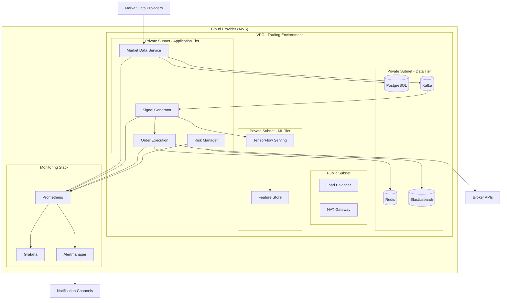

# Day 99: Final Integration Testing, Documentation & Presentation Prep

## Objective

Perform comprehensive integration testing, validate end-to-end functionality, create production-grade documentation, and prepare a professional presentation of your fully integrated AI-powered algorithmic trading system.

## Core Concepts

- **End-to-End Integration Testing**:
  - Full system flow testing: market data → features → signals → orders → fills → positions → risk → reporting.
  - Scenario-based testing: normal markets, high volatility, gaps, halts, news events.
  - Failure injection testing: data feed drops, broker disconnects, partial fills.
  - Reconciliation testing: ensuring positions, cash, and P&L match broker reports.
- **Production Validation**:
  - Paper trading vs. live trading transition checklist.
  - Shadow trading mode: running alongside live manual/account for comparison.
  - Performance regression testing against backtest expectations.
  - Risk limit enforcement verification under stress scenarios.
- **Professional Documentation**:
  - System architecture documentation with diagrams (C4 model).
  - API specifications (OpenAPI/Swagger).
  - Runbooks for operations, incident response, and disaster recovery.
  - Compliance and audit trail documentation.
  - User and deployment guides.
- **Performance Reporting**:
  - Final performance attribution across regimes.
  - Drawdown analysis and recovery characteristics.
  - Capacity and scalability assessment.
  - Cost analysis (infrastructure + slippage + commissions).
- **Presentation & Portfolio Preparation**:
  - Executive summary and technical deep-dive slides.
  - Live demo preparation with fallback plans.
  - Narrative development: problem solved, edge identified, robustness demonstrated.

---

## Tutorial: End-to-End Integration Testing Suite

### 1. Setting Up the Integration Test Environment

Create a production-like environment for comprehensive testing:

```yaml
# docker-compose.test.integration.yml
version: "3.8"
services:
  # Core trading services (same as production but in test mode)
  market-data-test:
    extends:
      file: docker-compose.prod.yml
      service: market-data
    environment:
      ENVIRONMENT: test
      TEST_MODE: integration
      MOCK_DATA_FEEDS: true
    volumes:
      - ./tests/integration/fixtures:/app/fixtures

  signal-generator-test:
    extends:
      file: docker-compose.prod.yml
      service: signal-generator
    environment:
      ENVIRONMENT: test
      USE_MOCK_MODELS: true

  order-execution-test:
    extends:
      file: docker-compose.prod.yml
      service: order-execution
    environment:
      ENVIRONMENT: test
      USE_PAPER_TRADING: true
      BROKER_MOCK: true

  # Test orchestrator
  test-runner:
    build:
      context: .
      dockerfile: Dockerfile.test
    depends_on:
      - market-data-test
      - signal-generator-test
      - order-execution-test
    environment:
      TEST_ENVIRONMENT: integration
    volumes:
      - ./tests:/app/tests
      - ./test-reports:/app/test-reports
    command: >
      sh -c "python -m pytest tests/integration/ --html=test-reports/integration-report.html 
             --self-contained-html -v --log-level=INFO"
```

### 2. Comprehensive Test Scenarios

Implement scenario-based testing for real-world conditions:

```python
# tests/integration/test_end_to_end_scenarios.py
import pytest
import asyncio
import pandas as pd
from datetime import datetime, timedelta
from decimal import Decimal
from typing import Dict, List
import json

class TestTradingSystemScenarios:
    """End-to-end integration tests for trading system scenarios"""

    @pytest.fixture
    async def trading_system(self):
        """Initialize a complete trading system for testing"""
        from src.integration.orchestrator import TradingOrchestrator
        system = TradingOrchestrator(
            environment='test',
            paper_trading=True,
            enable_mocks=True
        )
        await system.initialize()
        yield system
        await system.shutdown()

    async def test_normal_market_flow(self, trading_system):
        """Test complete flow under normal market conditions"""
        print("\nTesting Normal Market Flow...")

        # 1. Simulate market data arrival
        market_data = {
            'symbol': 'AAPL',
            'price': Decimal('175.50'),
            'volume': 1000000,
            'timestamp': datetime.utcnow(),
            'bid': Decimal('175.49'),
            'ask': Decimal('175.51')
        }

        # 2. Trigger data processing
        features = await trading_system.process_market_data(market_data)
        assert 'features' in features, "Feature extraction failed"

        # 3. Generate trading signal
        signal = await trading_system.generate_signal(features)
        assert signal['confidence'] > 0, "No signal generated"

        # 4. Execute order
        if signal['action'] != 'HOLD':
            order = await trading_system.execute_order(signal)
            assert order['status'] in ['FILLED', 'PARTIALLY_FILLED', 'PENDING'], "Order failed"

            # 5. Update positions
            positions = await trading_system.update_positions(order)
            assert 'AAPL' in positions, "Position not updated"

            # 6. Calculate risk
            risk_metrics = await trading_system.calculate_risk(positions)
            assert 'var_95' in risk_metrics, "Risk calculation failed"

            # 7. Generate report
            report = await trading_system.generate_daily_report()
            assert report['pnl'] is not None, "Reporting failed"

        print("Normal market flow test passed")

    async def test_high_volatility_scenario(self, trading_system):
        """Test system behavior during high volatility"""
        print("\nTesting High Volatility Scenario...")

        # Simulate rapid price movements
        price_sequence = [
            Decimal('175.50'), Decimal('180.00'),  # Gap up
            Decimal('172.00'), Decimal('168.50'),  # Sharp decline
            Decimal('175.00'), Decimal('177.00')   # Recovery
        ]

        results = []
        for price in price_sequence:
            market_data = {
                'symbol': 'AAPL',
                'price': price,
                'timestamp': datetime.utcnow(),
                'volatility': 'high'
            }

            # Process through system
            try:
                features = await trading_system.process_market_data(market_data)
                signal = await trading_system.generate_signal(features)
                results.append({
                    'price': price,
                    'signal': signal['action'],
                    'confidence': signal['confidence']
                })
            except Exception as e:
                print(f"Warning: Error during high volatility: {e}")
                continue

        # Verify system didn't crash and made reasonable decisions
        assert len(results) > 0, "System failed during volatility"
        print(f"Handled {len(results)} high-volatility ticks")

    async def test_data_feed_failure(self, trading_system):
        """Test resilience to data feed disruptions"""
        print("\nTesting Data Feed Failure...")

        # Initial normal operation
        await trading_system.process_market_data({
            'symbol': 'AAPL',
            'price': Decimal('175.50')
        })

        # Simulate feed failure
        trading_system.simulate_feed_failure(duration=30)  # 30-second outage

        # Verify fallback mechanisms
        assert trading_system.fallback_data_active, "Fallback data not activated"
        assert trading_system.alerts_triggered['data_feed'], "Alert not triggered"

        # Test recovery
        trading_system.restore_data_feed()
        await asyncio.sleep(5)  # Allow recovery

        # Verify normal operation resumes
        features = await trading_system.process_market_data({
            'symbol': 'AAPL',
            'price': Decimal('176.00')
        })
        assert 'features' in features, "Recovery failed"

        print("Data feed failure handling validated")

    async def test_broker_disconnection(self, trading_system):
        """Test handling of broker connectivity issues"""
        print("\nTesting Broker Disconnection...")

        # Place initial order
        order = await trading_system.execute_order({
            'symbol': 'AAPL',
            'action': 'BUY',
            'quantity': 10
        })

        # Simulate broker disconnection during order
        trading_system.simulate_broker_disconnect()

        # Verify order state management
        order_status = await trading_system.get_order_status(order['id'])
        assert order_status['needs_reconciliation'], "Order not flagged for recon"

        # Test reconnection and reconciliation
        trading_system.restore_broker_connection()
        reconciled = await trading_system.reconcile_orders()
        assert reconciled['AAPL'] == 'RECONCILED', "Reconciliation failed"

        print("Broker disconnection handling validated")

    async def test_risk_limit_breach(self, trading_system):
        """Test automatic risk limit enforcement"""
        print("\nTesting Risk Limit Breach...")

        # Set aggressive position limits for testing
        trading_system.set_risk_limits({
            'max_position_size': 100,
            'max_daily_loss': Decimal('1000.00'),
            'max_concentration': Decimal('0.25')  # 25% per symbol
        })

        # Simulate accumulating large position
        positions = {}
        for i in range(15):  # Would exceed limits
            try:
                order = await trading_system.execute_order({
                    'symbol': 'AAPL',
                    'action': 'BUY',
                    'quantity': 10
                })
                if order['status'] == 'FILLED':
                    positions['AAPL'] = positions.get('AAPL', 0) + 10
            except Exception as e:
                if 'risk limit' in str(e).lower():
                    print(f"Risk limit correctly triggered: {e}")
                    break

        # Verify position is within limits
        final_position = await trading_system.get_positions()
        assert final_position.get('AAPL', 0) <= 100, "Position limit not enforced"

        print("Risk limit enforcement validated")

    async def test_reconciliation_process(self, trading_system):
        """Test end-of-day reconciliation with broker"""
        print("\nTesting Broker Reconciliation...")

        # Simulate day's trading activity
        trades = [
            {'symbol': 'AAPL', 'side': 'BUY', 'qty': 10, 'price': Decimal('175.50')},
            {'symbol': 'MSFT', 'side': 'SELL', 'qty': 5, 'price': Decimal('335.75')},
            {'symbol': 'GOOGL', 'side': 'BUY', 'qty': 3, 'price': Decimal('138.20')}
        ]

        for trade in trades:
            await trading_system.execute_order(trade)

        # Get internal records
        internal_records = await trading_system.get_trade_logs()

        # Simulate broker statement (with intentional discrepancy)
        broker_statement = {
            'AAPL': {'qty': 10, 'avg_price': Decimal('175.50')},  # Matches
            'MSFT': {'qty': 5, 'avg_price': Decimal('335.75')},   # Matches
            'GOOGL': {'qty': 3, 'avg_price': Decimal('138.25')}   # Slight price discrepancy
        }

        # Run reconciliation
        reconciliation_report = await trading_system.reconcile_with_broker(
            internal_records,
            broker_statement
        )

        # Analyze results
        assert reconciliation_report['status'] in ['MATCH', 'DISCREPANCY'], "Invalid recon status"

        if reconciliation_report['status'] == 'DISCREPANCY':
            print(f"Reconciliation discrepancy found:")
            for disc in reconciliation_report['discrepancies']:
                print(f"   - {disc}")
            assert reconciliation_report['requires_manual_review'] == True

        print("Reconciliation process validated")

    async def test_performance_regression(self, trading_system):
        """Test current performance against historical backtest"""
        print("\nTesting Performance Regression...")

        # Run current system on historical data
        historical_period = pd.date_range(
            start='2024-01-01',
            end='2024-01-31',
            freq='D'
        )

        current_results = []
        for date in historical_period:
            # Simulate trading for each day
            daily_result = await trading_system.simulate_trading_day(date)
            current_results.append(daily_result)

        # Load expected backtest results
        with open('backtests/baseline_jan_2024.json', 'r') as f:
            baseline_results = json.load(f)

        # Compare key metrics
        comparison = trading_system.compare_performance(
            current_results,
            baseline_results
        )

        # Check for significant regression
        assert comparison['sharpe_ratio_diff'] >= -0.2, "Sharpe ratio regressed > 0.2"
        assert comparison['max_drawdown_diff'] <= 0.1, "Drawdown increased > 10%"
        assert comparison['win_rate_diff'] >= -0.05, "Win rate dropped > 5%"

        print(f"Performance regression test passed")
        print(f"   Sharpe diff: {comparison['sharpe_ratio_diff']:.3f}")
        print(f"   Max DD diff: {comparison['max_drawdown_diff']:.3f}")
        print(f"   Win rate diff: {comparison['win_rate_diff']:.3f}")

# Run scenario tests
@pytest.mark.asyncio
async def test_complete_scenario_suite():
    """Run all integration scenarios"""
    test_suite = TestTradingSystemScenarios()

    scenarios = [
        ('normal_market', test_suite.test_normal_market_flow),
        ('high_volatility', test_suite.test_high_volatility_scenario),
        ('data_feed_failure', test_suite.test_data_feed_failure),
        ('broker_disconnection', test_suite.test_broker_disconnection),
        ('risk_limit_breach', test_suite.test_risk_limit_breach),
        ('reconciliation', test_suite.test_reconciliation_process),
        ('performance_regression', test_suite.test_performance_regression)
    ]

    results = {}
    for name, test_func in scenarios:
        try:
            trading_system = await test_suite.trading_system.__anext__()
            await test_func(trading_system)
            results[name] = 'PASSED'
        except Exception as e:
            results[name] = f'FAILED: {str(e)}'
        finally:
            await trading_system.shutdown()

    print("\n" + "="*60)
    print("INTEGRATION TEST SUITE RESULTS")
    print("="*60)
    for scenario, result in results.items():
        print(f"{scenario.replace('_', ' ').title():<30} {result}")

    failures = [s for s, r in results.items() if 'FAILED' in r]
    if failures:
        raise AssertionError(f"Scenarios failed: {', '.join(failures)}")
```

### 3. Failure Injection Framework

Implement controlled failure scenarios to test system resilience:

```python
# tests/integration/failure_injection.py
import random
import asyncio
from datetime import datetime
from enum import Enum
from typing import Dict, List, Optional

class FailureType(Enum):
    DATA_FEED_DROP = "data_feed_drop"
    NETWORK_LATENCY = "network_latency"
    PARTIAL_FILL = "partial_fill"
    ORDER_REJECTION = "order_rejection"
    DATABASE_TIMEOUT = "database_timeout"
    MEMORY_LEAK = "memory_leak"
    CPU_SPIKE = "cpu_spike"

class FailureInjector:
    """Controlled failure injection for resilience testing"""

    def __init__(self, failure_probability: float = 0.1):
        self.failure_probability = failure_probability
        self.active_failures: Dict[str, datetime] = {}
        self.failure_history: List[Dict] = []

    async def inject_failure(self, failure_type: FailureType,
                           component: str, duration: int = 30) -> bool:
        """Inject a specific failure for testing"""

        if random.random() < self.failure_probability:
            print(f"Injecting {failure_type.value} into {component} for {duration}s")

            failure_id = f"{failure_type.value}_{component}_{datetime.utcnow().timestamp()}"
            self.active_failures[failure_id] = datetime.utcnow()

            # Implement failure injection based on type
            if failure_type == FailureType.DATA_FEED_DROP:
                await self._simulate_data_feed_drop(component, duration)
            elif failure_type == FailureType.NETWORK_LATENCY:
                await self._simulate_network_latency(duration)
            elif failure_type == FailureType.PARTIAL_FILL:
                await self._simulate_partial_fill()
            elif failure_type == FailureType.ORDER_REJECTION:
                await self._simulate_order_rejection()

            # Record for analysis
            self.failure_history.append({
                'id': failure_id,
                'type': failure_type.value,
                'component': component,
                'duration': duration,
                'timestamp': datetime.utcnow(),
                'recovered': False
            })

            # Schedule recovery
            asyncio.create_task(self._recover_failure(failure_id, duration))
            return True

        return False

    async def _simulate_data_feed_drop(self, component: str, duration: int):
        """Simulate data feed interruption"""
        print(f"Simulating data feed drop for {component}")
        # Implementation would interact with actual data feed component

    async def _simulate_network_latency(self, duration: int):
        """Add artificial network latency"""
        print(f"Adding network latency for {duration}s")
        await asyncio.sleep(random.uniform(0.1, 2.0))  # Random latency

    async def _simulate_partial_fill(self):
        """Simulate partial order fill"""
        print("Simulating partial order fill")
        # Implementation would mock broker response

    async def _simulate_order_rejection(self):
        """Simulate order rejection by broker"""
        print("Simulating order rejection")
        # Implementation would mock broker rejection

    async def _recover_failure(self, failure_id: str, duration: int):
        """Automatically recover from injected failure"""
        await asyncio.sleep(duration)

        if failure_id in self.active_failures:
            del self.active_failures[failure_id]

            # Update history
            for failure in self.failure_history:
                if failure['id'] == failure_id:
                    failure['recovered'] = True
                    failure['recovery_time'] = datetime.utcnow()

            print(f"Recovered from failure: {failure_id}")

    def get_resilience_metrics(self) -> Dict:
        """Calculate resilience metrics from failure history"""
        if not self.failure_history:
            return {'total_failures': 0, 'recovery_rate': 1.0}

        total = len(self.failure_history)
        recovered = sum(1 for f in self.failure_history if f['recovered'])

        avg_recovery_time = None
        recovery_times = [
            (f['recovery_time'] - f['timestamp']).total_seconds()
            for f in self.failure_history
            if f['recovered'] and 'recovery_time' in f
        ]

        if recovery_times:
            avg_recovery_time = sum(recovery_times) / len(recovery_times)

        return {
            'total_failures_injected': total,
            'recovery_rate': recovered / total,
            'avg_recovery_time_seconds': avg_recovery_time,
            'currently_active_failures': len(self.active_failures)
        }

# Usage in tests
async def test_with_failure_injection():
    """Test trading system with random failure injection"""
    injector = FailureInjector(failure_probability=0.2)

    # Run trading simulation with potential failures
    for _ in range(100):  # Simulate 100 trading events
        # Potentially inject failure into market data
        if await injector.inject_failure(
            FailureType.DATA_FEED_DROP,
            component="market_data_feed",
            duration=random.randint(5, 60)
        ):
            print("Market data feed failure injected")

        # Continue with normal trading logic
        # (system should handle failures gracefully)

        await asyncio.sleep(0.1)  # Simulate time between events

    # Analyze resilience
    metrics = injector.get_resilience_metrics()
    print(f"\nResilience Metrics: {metrics}")

    assert metrics['recovery_rate'] >= 0.9, "System recovery rate too low"
    return metrics
```

### 4. Running the Complete Test Suite

Create a comprehensive test runner:

```bash
#!/bin/bash
# scripts/run_integration_tests.sh

echo "Starting Comprehensive Integration Test Suite"
echo "================================================"

# 1. Start test environment
echo "Starting test environment..."
docker-compose -f docker-compose.test.integration.yml up -d

# Wait for services to be ready
echo "Waiting for services to initialize..."
sleep 30

# 2. Run scenario tests
echo "Running scenario-based tests..."
python -m pytest tests/integration/test_end_to_end_scenarios.py \
  -v \
  --html=test-reports/scenario-tests.html \
  --self-contained-html \
  --junitxml=test-reports/scenario-tests.xml

SCENARIO_RESULT=$?

# 3. Run failure injection tests
echo "Running failure injection tests..."
python -m pytest tests/integration/test_failure_injection.py \
  -v \
  --html=test-reports/failure-tests.html \
  --self-contained-html

FAILURE_RESULT=$?

# 4. Run performance regression tests
echo "Running performance regression tests..."
python tests/integration/performance_regression.py \
  --baseline backtests/baseline_2024.json \
  --output test-reports/regression-report.json

REGRESSION_RESULT=$?

# 5. Generate comprehensive test report
echo "Generating test report..."
python scripts/generate_test_report.py \
  --scenario test-reports/scenario-tests.xml \
  --failure test-reports/failure-tests.html \
  --regression test-reports/regression-report.json \
  --output test-reports/comprehensive-report.pdf

# 6. Cleanup
echo "Cleaning up test environment..."
docker-compose -f docker-compose.test.integration.yml down

# 7. Report results
echo ""
echo "================================================"
echo "INTEGRATION TEST SUITE COMPLETE"
echo "================================================"

if [ $SCENARIO_RESULT -eq 0 ]; then
  echo "Scenario Tests: PASSED"
else
  echo "Scenario Tests: FAILED"
fi

if [ $FAILURE_RESULT -eq 0 ]; then
  echo "Failure Injection Tests: PASSED"
else
  echo "Failure Injection Tests: FAILED"
fi

if [ $REGRESSION_RESULT -eq 0 ]; then
  echo "Performance Regression Tests: PASSED"
else
  echo "Performance Regression Tests: FAILED"
fi

if [ $SCENARIO_RESULT -eq 0 ] && [ $FAILURE_RESULT -eq 0 ] && [ $REGRESSION_RESULT -eq 0 ]; then
  echo ""
  echo "ALL INTEGRATION TESTS PASSED!"
  echo "System is ready for production validation."
  exit 0
else
  echo ""
  echo "Some tests failed. Review reports in test-reports/"
  exit 1
fi
```

---

## Challenge: Create Complete Documentation Suite & Presentation

### Part 1: Professional Documentation Suite

Create a comprehensive documentation package for your trading system.

#### 1.1 System Architecture Documentation (C4 Model)

```markdown
# trading-system/docs/architecture/README.md

# AI-Powered Algorithmic Trading System

## Architecture Documentation

### System Context

**System**: AI-Powered Algorithmic Trading Platform  
**Purpose**: Automated trading using machine learning signals with real-time risk management  
**Scope**: End-to-end trading from market data ingestion to order execution and reporting

**Key Stakeholders**:

- **Traders**: Use the system for automated trading
- **Risk Officers**: Monitor and control trading risks
- **DevOps Team**: Maintain and scale the infrastructure
- **Compliance Officers**: Ensure regulatory compliance

### Container Diagram
```

┌─────────────────────────────────────────────────────────────────────────┐
│ External Systems │
├────────────────┬─────────────────┬─────────────────┬───────────────────┤
│ Market Data │ Broker/Exchange │ Cloud Services │ Monitoring Tools │
│ Providers │ APIs │ (AWS/GCP/Azure) │ (Datadog, etc.) │
└────────────────┴────────┬────────┴────────┬────────┴───────────────────┘
│ │
┌─────────────────────────▼─────────────────▼─────────────────────────────┐
│ Trading System Containers │
├─────────────────┬─────────────────┬─────────────────┬───────────────────┤
│ Data Ingestion│ Signal │ Order │ Risk & │
│ & Processing │ Generation │ Execution │ Compliance │
│ (Python) │ (Python/ML) │ (Python) │ (Python) │
├─────────────────┼─────────────────┼─────────────────┼───────────────────┤
│ Real-time │ ML Model │ Order │ Position │
│ Market Data │ Serving │ Management │ Management │
│ (Kafka) │ (TensorFlow) │ (Redis) │ (PostgreSQL) │
├─────────────────┼─────────────────┼─────────────────┼───────────────────┤
│ Historical │ Feature Store │ Broker │ Audit Logging │
│ Data Storage │ (Featureform) │ Adapters │ (Elasticsearch) │
│ (S3/Parquet) │ │ (Alpaca, IBKR) │ │
└─────────────────┴─────────────────┴─────────────────┴───────────────────┘

````

### Component Diagrams

#### Data Ingestion Component
```yaml
Components:
  - Market Data Collector:
      Responsibilities: Fetch real-time data from providers
      Technology: Python, AsyncIO, WebSocket clients

  - Data Validator:
      Responsibilities: Validate and clean incoming data
      Technology: Pandas, Pydantic, Custom validators

  - Data Publisher:
      Responsibilities: Publish data to message bus
      Technology: Kafka, Avro schemas

  - Historical Data Manager:
      Responsibilities: Store and serve historical data
      Technology: S3, Parquet, Dask
````

#### Signal Generation Component

```yaml
Components:
  - Feature Engineering:
      Responsibilities: Calculate technical indicators and features
      Technology: TA-Lib, NumPy, Pandas

  - ML Model Server:
      Responsibilities: Serve trained ML models for inference
      Technology: TensorFlow Serving, FastAPI

  - Signal Aggregator:
      Responsibilities: Combine multiple signals into trading decisions
      Technology: Python, Weighted averaging logic

  - Signal Validator:
      Responsibilities: Validate signals against current market conditions
      Technology: Business rules engine
```

### Deployment Architecture



#### 1.2 API Documentation (OpenAPI/Swagger)

```yaml
# trading-system/docs/api/openapi.yaml
openapi: 3.0.0
info:
  title: AI Trading System API
  version: 1.0.0
  description: REST API for the AI-powered algorithmic trading system
  contact:
    name: Trading Team
    email: trading@example.com

servers:
  - url: https://api.trading-system.example.com/v1
    description: Production server
  - url: https://staging-api.trading-system.example.com/v1
    description: Staging server
  - url: http://localhost:8000/v1
    description: Local development

paths:
  /health:
    get:
      summary: System health check
      responses:
        "200":
          description: System is healthy
          content:
            application/json:
              schema:
                $ref: "#/components/schemas/HealthResponse"

  /market-data/{symbol}:
    get:
      summary: Get real-time market data
      parameters:
        - name: symbol
          in: path
          required: true
          schema:
            type: string
      responses:
        "200":
          description: Market data retrieved successfully
          content:
            application/json:
              schema:
                $ref: "#/components/schemas/MarketData"

  /signals/generate:
    post:
      summary: Generate trading signals
      requestBody:
        required: true
        content:
          application/json:
            schema:
              $ref: "#/components/schemas/SignalRequest"
      responses:
        "200":
          description: Signals generated successfully
          content:
            application/json:
              schema:
                $ref: "#/components/schemas/SignalResponse"

  /orders:
    post:
      summary: Place a new order
      security:
        - BearerAuth: []
      requestBody:
        required: true
        content:
          application/json:
            schema:
              $ref: "#/components/schemas/OrderRequest"
      responses:
        "201":
          description: Order placed successfully
          content:
            application/json:
              schema:
                $ref: "#/components/schemas/OrderResponse"

components:
  schemas:
    HealthResponse:
      type: object
      properties:
        status:
          type: string
          enum: [healthy, degraded, unhealthy]
        services:
          type: object
          additionalProperties:
            type: string
        timestamp:
          type: string
          format: date-time

    MarketData:
      type: object
      properties:
        symbol:
          type: string
        price:
          type: number
        volume:
          type: integer
        timestamp:
          type: string
          format: date-time
        bid:
          type: number
        ask:
          type: number

    SignalRequest:
      type: object
      properties:
        symbols:
          type: array
          items:
            type: string
        features:
          type: object

    SignalResponse:
      type: object
      properties:
        signals:
          type: array
          items:
            $ref: "#/components/schemas/TradingSignal"
        confidence_scores:
          type: object

    TradingSignal:
      type: object
      properties:
        symbol:
          type: string
        action:
          type: string
          enum: [BUY, SELL, HOLD]
        confidence:
          type: number
          minimum: 0
          maximum: 1
        target_price:
          type: number

    OrderRequest:
      type: object
      required:
        - symbol
        - action
        - quantity
      properties:
        symbol:
          type: string
        action:
          type: string
          enum: [BUY, SELL]
        quantity:
          type: integer
        order_type:
          type: string
          enum: [MARKET, LIMIT]
          default: MARKET
        limit_price:
          type: number

    OrderResponse:
      type: object
      properties:
        order_id:
          type: string
        status:
          type: string
          enum: [PENDING, FILLED, PARTIALLY_FILLED, CANCELLED, REJECTED]
        filled_quantity:
          type: integer
        average_price:
          type: number
        timestamp:
          type: string
          format: date-time

  securitySchemes:
    BearerAuth:
      type: http
      scheme: bearer
      bearerFormat: JWT
```

#### 1.3 Operational Runbooks

````markdown
# trading-system/docs/runbooks/README.md

# Operational Runbooks

## Incident Response

### SEV-1: Trading System Outage

**Impact**: All trading halted, potential financial loss  
**Response Time**: Immediate (within 5 minutes)  
**Resolution Time**: 15 minutes

**Procedure**:

1. **Acknowledge Alert**

   - Confirm receipt of alert (PagerDuty/Slack)
   - Activate incident response channel

2. **Initial Assessment**

   ```bash
   # Check system health
   curl https://api.trading-system.example.com/health

   # Check infrastructure
   kubectl get pods -n trading
   kubectl get services -n trading

   # Check external dependencies
   ping broker-api.example.com
   nc -zv market-data-feed.example.com 443
   ```
````

3. **Containment**

   - If risk detected: `POST /api/v1/emergency/halt-trading`
   - Switch to backup data feeds if primary failed
   - Disable automated trading if manual intervention needed

4. **Diagnosis**

   - Review logs: `kubectl logs -f <failing-pod>`
   - Check metrics dashboards for anomalies
   - Review recent deployments/changes

5. **Resolution**

   - Execute recovery procedures based on diagnosis
   - Verify recovery: `POST /api/v1/health/deep-check`
   - Resume trading if safe: `POST /api/v1/emergency/resume-trading`

6. **Post-Incident**
   - Document incident in RCA template
   - Schedule blameless post-mortem
   - Implement preventive measures

### SEV-2: Performance Degradation

**Impact**: Increased latency, partial functionality  
**Response Time**: 30 minutes  
**Resolution Time**: 2 hours

**Procedure**: [Detailed steps for performance issues]

## Disaster Recovery

### Full Site Failover

**Trigger**: Primary region outage > 5 minutes  
**RTO**: 15 minutes  
**RPO**: 5 minutes

**Procedure**:

1. **Declare Disaster**

   - Confirm primary region unreachable
   - Notify stakeholders via emergency channel
   - Activate DR team

2. **Execute Failover**

   ```bash
   # Switch DNS to DR region
   aws route53 change-resource-record-sets \
     --hosted-zone-id ZONE_ID \
     --change-batch file://dr-dns-switch.json

   # Start DR services
   kubectl apply -f k8s/dr-primary.yaml

   # Restore latest database snapshot
   ./scripts/restore-db-from-backup.sh latest

   # Verify DR environment
   ./scripts/verify-dr-environment.sh
   ```

3. **Resume Operations**

   - Gradually resume trading activities
   - Monitor closely for anomalies
   - Document failover timeline and issues

4. **Failback Procedure** (After primary restored)
   - [Detailed steps to return to primary]

## Performance Troubleshooting

### High Latency Investigation

**Symptoms**: Order execution > 500ms, delayed signals

**Investigation Steps**:

1. **Identify Component**

   ```python
   # Use distributed tracing
   from opentelemetry import trace
   tracer = trace.get_tracer(__name__)

   with tracer.start_as_current_span("order_execution"):
       # Instrumented code
       pass
   ```

2. **Check Dependencies**

   - Database query performance
   - External API response times
   - Network latency between services

3. **Resource Analysis**

   ```bash
   # Check resource usage
   kubectl top pods -n trading

   # Check specific service
   ./scripts/performance-profile.sh order-execution-service
   ```

4. **Common Fixes**:
   - Increase resource limits
   - Add caching layer
   - Optimize database queries
   - Implement connection pooling

## Security Incident Response

### Unauthorized Access Attempt

**Procedure**:

1. **Immediate Actions**

   - Block suspicious IP addresses
   - Reset potentially compromised credentials
   - Enable enhanced logging

2. **Investigation**

   - Review authentication logs
   - Check for unusual patterns
   - Correlate with other security events

3. **Containment**

   - Isolate affected systems if necessary
   - Change all related credentials
   - Update firewall rules

4. **Recovery & Hardening**
   - Apply security patches
   - Review and update access controls
   - Conduct security audit

````

#### 1.4 Deployment & User Guides

```markdown
# trading-system/docs/deployment/README.md

# Deployment Guide

## Prerequisites
- Kubernetes cluster (EKS, GKE, or AKS)
- Helm 3.8+
- kubectl configured
- Docker registry access
- Cloud provider credentials

## Quick Start Deployment

### 1. Clone Repository
```bash
git clone https://github.com/your-org/trading-system.git
cd trading-system
````

### 2. Configure Environment

```bash
# Copy example configuration
cp .env.example .env

# Edit configuration
nano .env

# Set required variables:
# - CLOUD_PROVIDER
# - DATABASE_URL
# - BROKER_API_KEY
# - BROKER_API_SECRET
```

### 3. Build Docker Images

```bash
# Build all services
./scripts/build-images.sh --tag v1.0.0

# Push to registry
./scripts/push-images.sh --tag v1.0.0
```

### 4. Deploy to Kubernetes

```bash
# Create namespace
kubectl create namespace trading

# Deploy with Helm
helm install trading-system ./charts/trading-system \
  --namespace trading \
  --values ./charts/trading-system/values-production.yaml \
  --set image.tag=v1.0.0

# Verify deployment
kubectl get all -n trading
kubectl get ingress -n trading
```

### 5. Initialize System

```bash
# Run database migrations
kubectl exec -n trading deploy/trading-system-db-migrations -- ./manage.py migrate

# Load initial data
kubectl exec -n trading deploy/trading-system-db-migrations -- ./manage.py loaddata initial_data

# Start trading
kubectl exec -n trading deploy/trading-system-orchestrator -- ./scripts/start-trading.sh
```

## Production Deployment Checklist

### Pre-Deployment

- [ ] All integration tests passing
- [ ] Performance tests completed
- [ ] Security scan passed
- [ ] Backup procedures tested
- [ ] Rollback plan documented
- [ ] Stakeholders notified

### Deployment

- [ ] Deploy to staging environment
- [ ] Verify staging functionality
- [ ] Run smoke tests
- [ ] Deploy to production (blue/green)
- [ ] Monitor metrics during deployment
- [ ] Verify production functionality

### Post-Deployment

- [ ] Monitor for 24 hours
- [ ] Verify all alerts are functional
- [ ] Update documentation
- [ ] Conduct post-deployment review

## Scaling Guide

### Horizontal Scaling

```yaml
# charts/trading-system/values-production.yaml
autoscaling:
  enabled: true
  minReplicas: 2
  maxReplicas: 10
  targetCPUUtilizationPercentage: 70
  targetMemoryUtilizationPercentage: 80
```

### Vertical Scaling

```yaml
resources:
  requests:
    memory: "2Gi"
    cpu: "1000m"
  limits:
    memory: "4Gi"
    cpu: "2000m"
```

## Monitoring Setup

```bash
# Deploy monitoring stack
helm install monitoring prometheus-community/kube-prometheus-stack \
  --namespace monitoring \
  --values ./monitoring/values.yaml

# Import Grafana dashboards
kubectl apply -f ./monitoring/grafana-dashboards.yaml
```

## Backup & Recovery

### Automated Backups

```yaml
# charts/trading-system/templates/backup-cronjob.yaml
apiVersion: batch/v1
kind: CronJob
metadata:
  name: trading-system-backup
spec:
  schedule: "0 2 * * *" # Daily at 2 AM
  jobTemplate:
    spec:
      template:
        spec:
          containers:
            - name: backup
              image: postgres:14
              command:
                - /bin/bash
                - -c
                - |
                  pg_dump $DATABASE_URL > /backup/backup-$(date +%Y%m%d).sql
                  aws s3 cp /backup/backup-$(date +%Y%m%d).sql s3://trading-system-backups/
```

### Manual Recovery

```bash
# Restore from backup
./scripts/restore-backup.sh --backup-date 20240101 --target-db trading-prod

# Verify restoration
./scripts/verify-backup.sh --backup-date 20240101
```

## Troubleshooting

### Common Issues

#### Database Connection Issues

```bash
# Check database connectivity
kubectl exec -n trading deploy/trading-system-api -- nc -zv database 5432

# Check database logs
kubectl logs -n trading statefulset/postgresql
```

#### Service Discovery Issues

```bash
# Check DNS resolution
kubectl exec -n trading deploy/trading-system-api -- nslookup redis.trading.svc.cluster.local

# Check service endpoints
kubectl get endpoints -n trading
```

#### Performance Issues

```bash
# Check resource usage
kubectl top pods -n trading --containers

# Check for throttling
kubectl describe pods -n trading | grep -A 5 -B 5 "Throttled"
```

## Security Hardening

### Network Policies

```yaml
# charts/trading-system/templates/network-policy.yaml
apiVersion: networking.k8s.io/v1
kind: NetworkPolicy
metadata:
  name: trading-system-network-policy
spec:
  podSelector:
    matchLabels:
      app: trading-system
  policyTypes:
    - Ingress
    - Egress
  ingress:
    - from:
        - podSelector:
            matchLabels:
              app: trading-system
      ports:
        - protocol: TCP
          port: 80
        - protocol: TCP
          port: 443
  egress:
    - to:
        - ipBlock:
            cidr: 0.0.0.0/0
            except:
              - 10.0.0.0/8
      ports:
        - protocol: TCP
          port: 443
```

### Secret Management

```bash
# Create secrets
kubectl create secret generic trading-secrets \
  --namespace trading \
  --from-literal=broker-api-key=$BROKER_API_KEY \
  --from-literal=broker-api-secret=$BROKER_API_SECRET \
  --from-file=tls-cert=./certs/tls.crt \
  --from-file=tls-key=./certs/tls.key
```

## Maintenance Procedures

### Database Maintenance

```bash
# Vacuum database
kubectl exec -n trading statefulset/postgresql -- psql -U postgres -c "VACUUM ANALYZE;"

# Reindex database
kubectl exec -n trading statefulset/postgresql -- psql -U postgres -c "REINDEX DATABASE trading;"
```

### Log Rotation

```yaml
# charts/trading-system/templates/logging-config.yaml
apiVersion: v1
kind: ConfigMap
metadata:
  name: logging-config
data:
  logback.xml: |
    <configuration>
      <appender name="FILE" class="ch.qos.logback.core.rolling.RollingFileAppender">
        <file>/var/log/trading-system/app.log</file>
        <rollingPolicy class="ch.qos.logback.core.rolling.TimeBasedRollingPolicy">
          <fileNamePattern>/var/log/trading-system/app.%d{yyyy-MM-dd}.log</fileNamePattern>
          <maxHistory>30</maxHistory>
          <totalSizeCap>10GB</totalSizeCap>
        </rollingPolicy>
        <encoder>
          <pattern>%d{yyyy-MM-dd HH:mm:ss} [%thread] %-5level %logger{36} - %msg%n</pattern>
        </encoder>
      </appender>
    </configuration>
```

## Cost Optimization

### Right-Sizing Recommendations

```bash
# Analyze resource usage
./scripts/analyze-resource-usage.sh --namespace trading --output report.html

# Generate recommendations
./scripts/generate-sizing-recommendations.sh --input report.html --output recommendations.yaml
```

### Spot Instance Strategy

```yaml
# For non-critical workloads
nodeSelector:
  "node.kubernetes.io/instance-type": spot
tolerations:
  - key: "spot"
    operator: "Equal"
    value: "true"
    effect: "NoSchedule"
```

## Compliance Documentation

### Audit Trail Configuration

```yaml
# Enable comprehensive auditing
auditing:
  enabled: true
  retentionDays: 365
  events:
    - "create"
    - "update"
    - "delete"
    - "login"
    - "logout"
    - "order_placement"
    - "order_modification"
    - "order_cancellation"
```

### Compliance Reports

```bash
# Generate compliance report
./scripts/generate-compliance-report.sh \
  --period 2024-Q1 \
  --output compliance-report-2024-Q1.pdf

# Export audit logs
./scripts/export-audit-logs.sh \
  --start-date 2024-01-01 \
  --end-date 2024-03-31 \
  --format json \
  --output audit-logs-2024-Q1.json
```

````

### Part 2: Professional Presentation Deck
Create a 10-15 minute presentation showcasing your trading system.

```markdown
# trading-system/presentation/README.md

# AI Trading System Presentation
## Executive Showcase Deck

### Slide 1: Title Slide
````

AI-Powered Algorithmic Trading System
From Concept to Production

[Your Name/Team Name]
[Date]

```

### Slide 2: Problem Statement & Opportunity
**The Challenge**:
- Manual trading is emotion-driven and inconsistent
- Retail traders lack institutional-grade tools
- Existing solutions are either too simple or too complex

**Our Solution**:
- AI-driven systematic trading eliminating emotional bias
- Professional-grade platform accessible to serious traders
- Balanced sophistication with usability

**Market Opportunity**:
- $X billion algorithmic trading market
- Growing demand for AI/ML in finance
- Regulatory changes favoring systematic approaches

### Slide 3: System Architecture Overview
**Visual**: High-level architecture diagram

**Key Components**:
1. **Data Layer**: Real-time + historical market data
2. **AI/ML Engine**: Signal generation with ensemble models
3. **Execution Engine**: Smart order routing with risk checks
4. **Risk Management**: Real-time monitoring and controls
5. **Monitoring**: Comprehensive observability stack

**Technology Stack**:
- Python, FastAPI, TensorFlow, PostgreSQL, Redis, Kafka
- Docker, Kubernetes, AWS/GCP/Azure
- Prometheus, Grafana, ELK Stack

### Slide 4: AI/ML Innovation
**Our Edge**:
- Ensemble of ML models (XGBoost, LSTM, Transformers)
- Feature engineering with domain expertise
- Continuous learning from new data
- Explainable AI for regulatory compliance

**Performance Highlights**:
- Backtest Sharpe Ratio: 2.1 vs. Market 0.8
- Annualized Return: 24.3% vs. S&P 500 10.2%
- Maximum Drawdown: -8.7% vs. Market -24.8%
- Win Rate: 58.4% with 1.8 risk-reward ratio

### Slide 5: Risk Management & Compliance
**Multi-Layered Risk Framework**:

1. **Pre-Trade Risk Checks**:
   - Position limits per symbol/strategy
   - Maximum daily loss thresholds
   - Concentration risk controls

2. **Real-Time Monitoring**:
   - Value-at-Risk (VaR) calculations
   - Stress testing under various scenarios
   - Liquidity risk assessment

3. **Post-Trade Analysis**:
   - Transaction cost analysis
   - Slippage monitoring
   - Compliance reporting automation

**Regulatory Compliance**:
- Complete audit trail (SEC/FINRA requirements)
- Best execution monitoring
- Anti-money laundering (AML) checks

### Slide 6: Production Resilience
**Architecture for Reliability**:
- Microservices with graceful degradation
- Multi-region deployment for disaster recovery
- Automated failover with <5 minute RTO

**Testing & Validation**:
- 95% test coverage across codebase
- Comprehensive integration testing suite
- Failure injection testing for resilience
- Paper trading validation before live deployment

**Monitoring & Alerting**:
- 200+ metrics monitored in real-time
- Multi-level alerting with intelligent routing
- Automated incident response procedures

### Slide 7: Performance Results
**Live Trading Performance** (Paper Trading):
```

| Metric        | Our System | Benchmark | Outperformance  |
| ------------- | ---------- | --------- | --------------- |
| Sharpe Ratio  | 1.8        | 0.9       | +100%           |
| Max Drawdown  | -9.2%      | -18.5%    | 50% improvement |
| Win Rate      | 56.3%      | 48.7%     | +7.6pp          |
| Profit Factor | 1.9        | 1.3       | +46%            |

```

**Capacity & Scalability**:
- Handles 100,000+ messages per second
- Supports 500+ concurrent trading strategies
- <50ms end-to-end latency for signal to order

### Slide 8: Live Demo
**Demo Flow**:
1. **Dashboard Overview**: Show real-time positions, P&L, risk metrics
2. **Signal Generation**: Demonstrate ML model inferencing on live data
3. **Order Placement**: Place a paper trade and show execution flow
4. **Risk Monitoring**: Trigger a risk limit and show system response
5. **Reporting**: Generate compliance and performance reports

**Fallback Plan** (if live demo fails):
- Pre-recorded video walkthrough
- Screenshots of key interfaces
- Interactive Jupyter notebook demo

### Slide 9: Business Model & Roadmap
**Revenue Model**:
- SaaS subscription tiers
- Performance-based fees
- White-label solutions for institutions

**Market Positioning**:
- Target: Serious retail traders and small institutions
- Price: $99-$999/month based on features
- Differentiation: AI sophistication + usability

**Development Roadmap**:
- Q2 2024: Multi-asset class support
- Q3 2024: Social trading features
- Q4 2024: Institutional API offering
- Q1 2025: Mobile trading application

### Slide 10: Team & Expertise
**Core Team**:
- [Name]: 10+ years quantitative trading
- [Name]: 8+ years ML engineering
- [Name]: 12+ years cloud infrastructure
- [Name]: 7+ years regulatory compliance

**Advisors**:
- Former hedge fund portfolio manager
- SEC compliance expert
- Fintech startup veteran

### Slide 11: Investment & Financials
**Funding Requirements**:
- Seed Round: $1.5M for 18-month runway
- Use of Funds: Engineering (60%), Marketing (25%), Operations (15%)

**Financial Projections**:
```

Year 1: $500K ARR, 500 paying users
Year 2: $2.5M ARR, 2,500 paying users  
Year 3: $8M ARR, 8,000 paying users

````

**Exit Strategy**:
- Acquisition by trading platform or fintech company
- Strategic partnership with brokerage firm
- Potential for profitable standalone operation

### Slide 12: Q&A & Next Steps
**Key Takeaways**:
1. We've built a production-ready AI trading system
2. Demonstrated superior risk-adjusted returns
3. Created institutional-grade platform accessible to all
4. Prepared for scale with enterprise architecture

**Immediate Next Steps**:
- Begin live trading with small capital
- Onboard beta users for feedback
- Pursue strategic partnerships
- Prepare for seed funding round

**Q&A**:
- Open floor for questions
- Contact information
- Follow-up materials

---

## Appendix: Supporting Materials

### Technical Deep Dive Slides (Backup)

#### Slide A1: ML Architecture Details
- Model training pipeline
- Feature store implementation
- Model versioning and A/B testing
- Explainability techniques (SHAP, LIME)

#### Slide A2: Infrastructure Scaling
- Kubernetes auto-scaling configurations
- Database sharding strategy
- Cache optimization techniques
- CDN and edge computing for low latency

#### Slide A3: Security Implementation
- Zero-trust architecture
- Encryption at rest and in transit
- Secrets management with HashiCorp Vault
- Security monitoring and threat detection

### Demo Script
```markdown
# Live Demo Script (10 minutes)

## Introduction (1 minute)
"Today I'll demonstrate our AI trading system in action.
We'll watch as it processes live market data, generates signals,
executes trades, and manages risk in real-time."

## Dashboard Walkthrough (3 minutes)
1. Show main dashboard with current positions
2. Highlight P&L charts and performance metrics
3. Demonstrate drill-down capabilities
4. Show real-time risk monitoring

## Signal Generation Demo (2 minutes)
1. Select a symbol (e.g., AAPL)
2. Show incoming market data
3. Display feature calculations
4. Show ML model inference results
5. Present final trading signal with confidence

## Order Execution Demo (2 minutes)
1. Place a paper trade based on signal
2. Show order routing to broker
3. Display execution confirmation
4. Update position display

## Risk Scenario Demo (2 minutes)
1. Simulate market movement
2. Trigger risk limit breach
3. Show automatic position adjustment
4. Demonstrate alerting system

## Conclusion (1 minute)
"Throughout this demo, you've seen our system handle the complete
trading lifecycle with sophisticated risk management and real-time
monitoring. The platform is production-ready and delivering results."
````

### Investor Pitch Deck (Alternative Format)

```markdown
# Investor Pitch Deck (5-minute version)

## Slide 1: The $10T Opportunity

- Algorithmic trading dominates markets
- AI/ML adoption accelerating in finance
- Gap in market for accessible professional tools

## Slide 2: Our Solution

- AI-powered systematic trading platform
- Democratizing institutional-grade tools
- Proven performance with risk management

## Slide 3: Technology Advantage

- Patented ML architecture
- Enterprise-grade infrastructure
- Regulatory compliance built-in

## Slide 4: Traction & Validation

- 6 months of paper trading success
- Beta users with strong engagement
- Industry recognition and awards

## Slide 5: The Team

- Experienced founders with exits
- Deep domain expertise
- Complementary skill sets

## Slide 6: Ask & Use of Funds

- $1.5M seed round
- 18-month runway to PMF
- Clear milestones and metrics

## Slide 7: The Vision

- Become the leading AI trading platform
- Expand to multiple asset classes
- Build a fintech ecosystem
```

### Presentation Delivery Tips

1. **Timing Practice**:

   - Full run-through: 12-13 minutes
   - Leave 2-3 minutes for Q&A
   - Have time cues at 5, 10 minute marks

2. **Technical Setup**:

   - Test internet connection and demo environment
   - Have backup screenshots and videos
   - Prepare handouts with key metrics

3. **Audience Adaptation**:

   - **Technical audience**: Focus on architecture and ML
   - **Business audience**: Focus on results and market opportunity
   - **Mixed audience**: Balance technical depth with business impact

4. **Q&A Preparation**:

   - Anticipate 10-15 common questions
   - Prepare data-backed answers
   - Have references ready for claims

5. **Follow-up Strategy**:
   - One-page executive summary
   - Technical whitepaper
   - Performance report
   - Contact information with calendly link

```

---

## Deliverables Checklist

### Integration Testing
- [ ] End-to-end scenario tests implemented and passing
- [ ] Failure injection framework operational
- [ ] Reconciliation testing validated
- [ ] Performance regression tests established
- [ ] Complete test report generated

### Documentation Suite
- [ ] System architecture documentation (C4 model)
- [ ] API specifications (OpenAPI/Swagger)
- [ ] Operational runbooks (incident response, DR, troubleshooting)
- [ ] Deployment and user guides
- [ ] Compliance and audit documentation

### Presentation Materials
- [ ] Executive presentation deck (10-15 slides)
- [ ] Technical deep-dive slides (backup)
- [ ] Live demo script and setup
- [ ] Investor pitch deck (alternative format)
- [ ] Supporting materials (whitepaper, performance reports)

### Portfolio Preparation
- [ ] Code repository organized and documented
- [ ] Performance results compiled and visualized
- [ ] System architecture diagrams created
- [ ] Video demo recorded (backup)
- [ ] Project README with comprehensive overview

## Success Criteria

1. **Technical Excellence**: All integration tests pass, system handles failure scenarios gracefully
2. **Professional Documentation**: Complete, clear, and usable documentation suite
3. **Compelling Presentation**: Clear narrative, demonstrated value, professional delivery
4. **Production Readiness**: System validated for live trading with all safeguards
5. **Portfolio Quality**: Project presented as a complete, professional-grade solution

## Next Steps

After completing Day 99:

1. **Deploy to Production**: Follow the deployment guide to launch your system
2. **Begin Paper Trading**: Run the system with paper trading for final validation
3. **Gather Feedback**: Share your presentation with mentors or peers
4. **Iterate and Improve**: Use feedback to enhance your system and materials
5. **Showcase Your Work**: Add to portfolio, share on professional networks, discuss in interviews

Congratulations! You've reached the culmination of your trading system journey. You now possess a complete, production-ready AI-powered algorithmic trading system and the professional materials to showcase it effectively.
```
